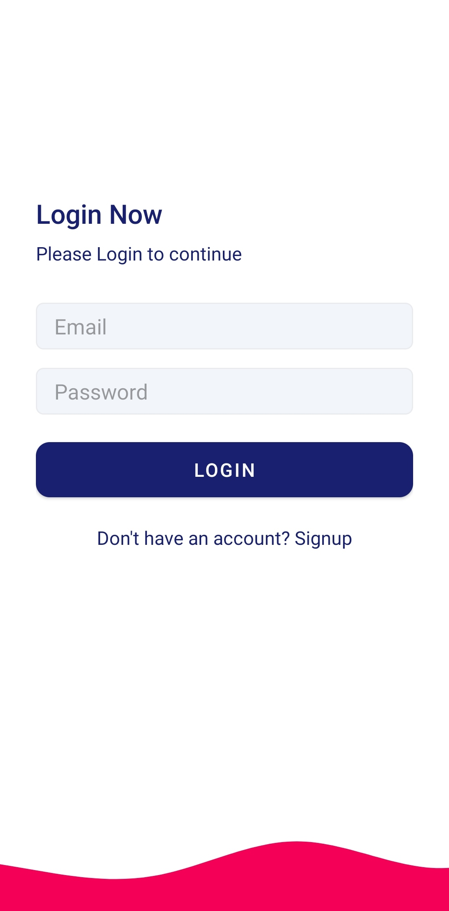
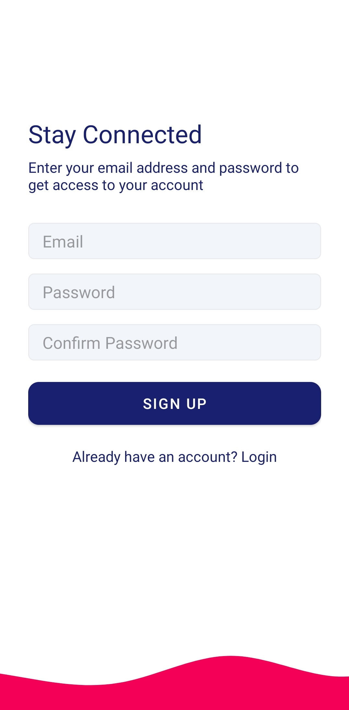
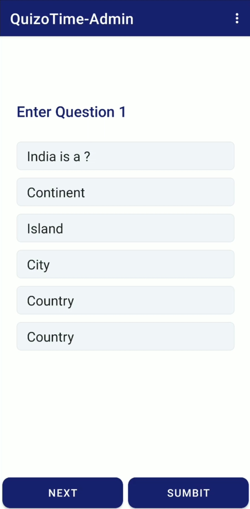

# QuizOTime-Admin

Hello Everyone 😊,
This application i.e. "QuizOTime-Admin" is an extension to the quiz app i made(QuizOTime).By using this app we can add quiz to the firestore database which further can be attemted in QuizOTime. I made this application by using the following concepts:-
1. Firebase Authentication
2. Firebase Firesore
3. Designing of Views

Here are the glimpse of the UI of the app:-

<h4>Login Screen</h4>

  

<h4>Sigup Screen</h4>

  

<h4>Questions Screen</h4>

  

<h4>Quiz Submitted</h4>

  

